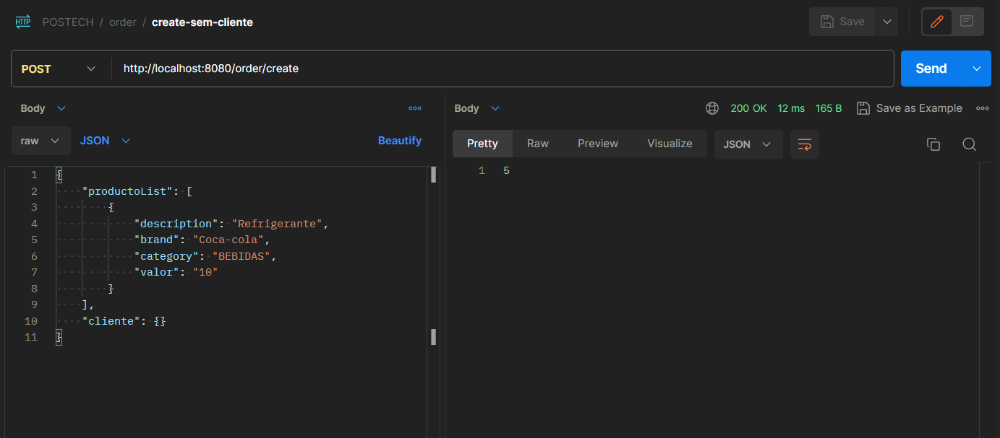

# Challenger POS-TECH 

## 💻 Projeto
Projeto para desenvolvimento de sistema de fast food, para apoio a uma lanchonete de baiiro que está expandindo suas operacoes devido seu grande sucesso. 

Entrega parte 1 (APIs):
  ```sh
* Cadastro de cliente
  * Identificação via cpf
* Crud Produtos
* Buscar produto por categoria
* Fake checkout 
* Lista de pedidos 
  ```

Entrega parte 2 (APIs e Infraestrutura):
  ```sh
* Configuração de infra escalável e orquestrada com k8s
  * 
* Refatoração da app, aplicando conceitos de Clean Architecture
  * Checkout pedidos 
  * Atualização de status pedido (RECEBIDO, EM_PREPARACAO, PRONTO)
  * Listagem de pedidos de forma ordenada (data_chegada e status_pedido)
  ```

## 🔖 Infraestrutura

### Built With

* Java 8+
* Maven 3.3+ 
* Docker
* Minikube
* Kubernetes 1.26+

### Prerequisites

Assumimos que para rodar as instruções que serão passadas na ** Parte 2 ** que o Kubernetes e o Minikube (ou outra tecnologia que provisione um cluster K8s local para teste) estejam instalados corretamente.

**Parte 1**
* docker
  ```sh
  sudo apt-get install docker.io
  ```
* docker-compose
  ```sh
  sudo apt-get install docker-compose
  ```
**Parte 2**

  Garantir que o serviço docker esteja em execução
  
  WSL
  ```sh
  sudo service start docker
  ```
  Linux
  ```sh
  sudo systemctl start docker
  ```
  Inicialize o Minikube
  ```sh
  minikube start
  ```
  


### Installation

**Parte 1**

  1. Clone the repo
     ```sh
     git clone https://github.com/belo355/java-challenger-food-fiap.git
     ```
  2. Build docker images
     ```sh
     docker-compose build --no-cache --pull
     ```
  3. Run docker app
     ```sh
     docker-compose up
     ```
  4. (Optional) for windows maybe need to add into dockerfile:
     ```sh
     RUN dos2unix mvnw
   ```
**Parte 2**

  1. Acessar o diretório /infra, onde a estrutura do k8s foi armazenada
  ```sh
  cd infra/
  ```
  2. Subir a estrutura do banco de dados
  ```sh
  kubectl apply -f database/
  ```
  3. Subir a estrutura da aplicação
  ```sh
  kubectl apply -f api/
  ```
  4. Para realizar o acesso a aplicação, utilize a URL fornecida pelo Minikube
  ```sh
  minikube service api-fastfood-service --url
  ```

## 🚀 Vamos  Começar 

Abaixo segue configurações locais e exemplos de apis entregues nas partes 1 e 2 

### API Especification - 👀 Tea with my! 
Docker (local)
```sh
http://localhost:8080/swagger-ui/index.html
```
K8s, substituir a "PORT" com a porta fornecida pelo Minikube, na etapa 4 (Parte 2)
```sh
http://127.0.0.1:{PORT}/swagger-ui/index.html # substituir a PORT pela porta fornecida pelo minikube
```

### Application 👋 Les't code !

- Na parte 1 usamos o localhost:8080 para direcionar os CRUDs
- Na parte 2 precisamos utilizar a porta fornecida pelo Minikube (ver Parte 2 item 4)

- [x] Identificação de cliente 
 ```sh
  curl --location 'http://127.0.0.1:{PORT}/cliente/registre' \
--header 'Content-Type: application/json' \
--data-raw '{
    "name":"Jose da Silva",
    "age": "30", 
    "mail": "jose123@gmail.com",
    "document": "12345678910"
}'
   ```


- [x] Criação de pedidos 
  - Para criação do pedido nao fica obrigatório o uso da estrutura de clientes, exemplo a seguir: 
 ```sh
curl --location 'http://127.0.0.1:{PORT}/order/create' \
--header 'Content-Type: application/json' \
--data-raw '{
    "productoList": [
        {
            "description": "Refrigerante",
            "brand": "Coca-cola",
            "category": "BEBIDAS",
            "valor": "10"
        }
    ],
    "cliente": {
        "id": 1,
        "name": "Jose da Silva",
        "age": 30,
        "mail": "jose123@gmail.com",
        "document": "12345678910"
    }
}'
   ```


-- criação de pedido sem cliente
 ```sh
curl --location 'http://127.0.0.1:{PORT}/order/create' \
--header 'Content-Type: application/json' \
--data-raw '{
    "productoList": [
        {
            "description": "Refrigerante",
            "brand": "Coca-cola",
            "category": "BEBIDAS",
            "valor": "10"
        }
    ],
    "cliente": {}
}'
   ```


- [x] Listagem de pedidos
  - a listagem de pedidos é retornada de forma ordenada, sendo os parametros de ordem (data de chegada e status do pedido)
 ```sh
curl --location 'http://127.0.0.1:{PORT}/order' \
--data ''
   ```


